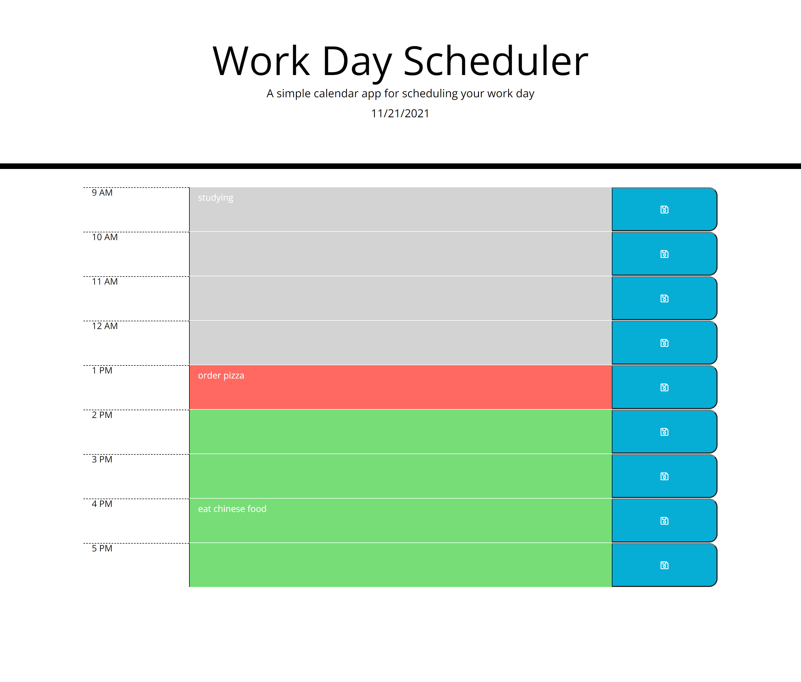

# Work Day Planner

## Objective
The purpose of this site is to have a work day planner in order to better organize your work day and manage time. It uses HTML, CSS, and Javascript. 
I did not use moment.js due to it being legacy code. Instead, I used Luxon for tracking the date and current time. below is the link to the site and screenshot of it.

URL:  https://austin-espinal.github.io/work-day-planner/

